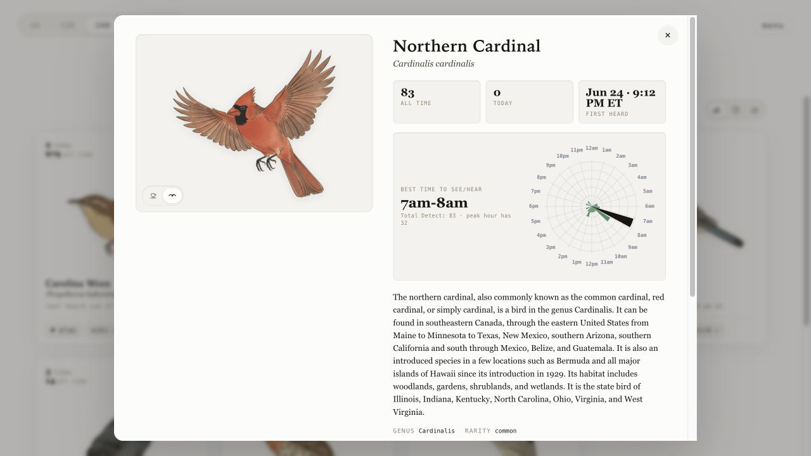

# Avian Visitors - Central / North America Artwork Edition

A BirdNET-Pi display that turns recent detections into an illustrated bird collage, a browsable bird atlas, and a local guide to when each species is most likely to be seen or heard.

This is a fork of the [Twarner491/AvianVisitors](https://github.com/Twarner491/AvianVisitors) project, which itself builds on the BirdNET-Pi ecosystem. The original README is saved as [`README.upstream.md`](README.upstream.md). This edition keeps the local Pi display and public mirror workflow, but adds a broad Central / North America artwork pack, a new Atlas best-time clock, safer collage packing for replaced artwork, and a read-only public mirror path.



## What changed

- Added a Central / North America bird illustration pack under [`avian/assets/illustrations`](avian/assets/illustrations), with perched and alternate-pose artwork for many additional species.
- Added an Atlas detail panel that shows the best time to see or hear each bird based on that species' previous BirdNET detections.
- Added a radial 24-hour clock dial inspired by BirdNET-Pi's existing hourly Plotly chart. The darkest wedge marks the peak detection hour, while the smaller green wedges show other active hours.
- Extended the local `birdnet-api.php?action=species` endpoint with a `time_profile` payload so the UI can calculate species-specific activity patterns from `birds.db`.
- Updated the Netlify mirror exporter so public mirror snapshots can include the same species time-profile data.
- Tightened the collage layout with a rendered-image guard so replaced regional artwork is less likely to overlap when masks are stale or optimistic.
- Kept the public mirror read-only: no admin tools, no direct Pi exposure, and no private audio by default.

## New Atlas best-time clock

Clicking a bird in the Atlas opens a detail modal with the illustration, detection counts, Wikipedia/eBird links, recordings on the local Pi, and now a **best time to see/hear** section.

The clock uses all previous detections for that species. It groups detections by hour, finds the strongest hour, and renders a compact circular histogram:

- The headline shows the peak hour window, such as `7am-8am`.
- The radial wedges show all hours when the bird has been detected.
- The darkest wedge marks the most active hour.
- The total detection count gives context for how much history supports the recommendation.

The result is a more personal Atlas: instead of only showing which birds have visited, it also answers, "When should I go look or listen for this species here?"

## Artwork edition notes

This branch replaces and expands the bird artwork used by the collage and Atlas. The artwork set is intended for Central and North America-focused BirdNET-Pi installations, while still preserving the core AvianVisitors UI and deployment model.

## Local Pi display

Install the same way as the upstream project, but point the installer at your fork once you publish it:

```bash
ssh <your-username>@birdnet.local
curl -s https://raw.githubusercontent.com/YOUR_GITHUB_USER/AvianVisitors/main/newinstaller.sh | bash
```

After the Pi reboots:

- Collage UI: `http://birdnet.local/`
- Stock BirdNET-Pi UI: `http://birdnet.local/index.php`

The local Pi version keeps the menu and admin tools because it is meant for your LAN.

## Public mirror

The public mirror is for friends and family. The included implementation uses Netlify. It serves the same collage, stats, and atlas views, but it does not expose the Pi itself.

Public mirror behavior:

- The menu button is hidden.
- Admin routes are blocked in the browser.
- The Netlify `menu.php` shim returns no menu items.
- Private endpoints such as recordings, spectrograms, config, and Pi status return `404`.
- Bird audio is not mirrored.
- Updates arrive only when the Pi posts a snapshot. If the Pi is unplugged, the Netlify site keeps showing the last snapshot and stops changing.

### Mirror setup

In Netlify, set this environment variable:

```bash
AVIAN_MIRROR_PUSH_TOKEN=replace-with-a-long-random-token
```

Then update these placeholders:

- [`netlify-mirror/public/index.html`](netlify-mirror/public/index.html): replace `YOUR_NETLIFY_SITE` and `[insert your location]`.
- [`netlify-mirror/scripts/avian-mirror-export.py`](netlify-mirror/scripts/avian-mirror-export.py): replace `YOUR_NETLIFY_SITE`, or set `AVIAN_MIRROR_INGEST_URL` on the Pi.
- [`netlify-mirror/netlify/functions/wiki.mts`](netlify-mirror/netlify/functions/wiki.mts): replace `YOUR_NETLIFY_SITE` in the user agent.

Build check:

```bash
cd netlify-mirror
npm install
npm run build
```

Deploy only after the placeholders and token are set:

```bash
netlify deploy --prod --dir=public
```

### First Pi push

Copy the mirror scripts to the Pi:

```bash
scp netlify-mirror/scripts/avian-mirror-export.py birdnet.local:~/BirdNET-Pi/scripts/
scp netlify-mirror/scripts/avian-mirror-watch-push.sh birdnet.local:~/BirdNET-Pi/scripts/
```

Create `~/.avian-visitors-mirror.env` on the Pi:

```bash
AVIAN_MIRROR_PUSH_TOKEN=replace-with-the-same-token
AVIAN_MIRROR_INGEST_URL=https://YOUR_NETLIFY_SITE.netlify.app/api/mirror/ingest
```

Post one snapshot:

```bash
ssh birdnet.local
source ~/.avian-visitors-mirror.env
python3 ~/BirdNET-Pi/scripts/avian-mirror-export.py --post
```

For ongoing updates, run `avian-mirror-watch-push.sh` under systemd or another process supervisor. The watcher waits briefly after the database changes, then posts a fresh snapshot.

### Using another host

The mirror is not tied to Netlify. Netlify is just the implementation included here. To run the mirror on another host, serve [`netlify-mirror/public`](netlify-mirror/public) as the static site and provide these routes:

- `GET /avian/api/birdnet-api.php?action=stats`
- `GET /avian/api/birdnet-api.php?action=lifelist`
- `GET /avian/api/birdnet-api.php?action=timeseries`
- `GET /avian/api/birdnet-api.php?action=firstseen`
- `GET /avian/api/birdnet-api.php?action=recent&hours=24`
- `GET /avian/api/birdnet-api.php?action=species&sci=Cardinalis%20cardinalis`
- `POST /api/mirror/ingest`
- `GET /avian/api/cutout.php?sci=Cardinalis%20cardinalis`
- `GET /avian/api/menu.php`
- `GET /avian/api/wiki.php?sci=Cardinalis%20cardinalis`

The checked-in Netlify functions are the reference implementation. A Cloudflare Pages Functions, Vercel Functions, small VPS, or other backend can use the same pattern:

- Store the latest snapshot posted by the Pi.
- Read from that snapshot for the `birdnet-api.php` actions.
- Redirect `cutout.php` to the matching PNG in `/avian/assets/illustrations/`.
- Return `{ "items": [] }` from `menu.php`.
- Return `404` for private routes such as recordings, spectrograms, config, and Pi status.
- Keep `POST /api/mirror/ingest` token-protected.

Pure static hosts need one extra adapter because there is nowhere to receive the Pi's snapshot post or answer the API routes. For those, publish the snapshot JSON yourself and adjust the frontend to read that file directly.

## Repo layout

```text
avian/
  frontend/       Local BirdNET-Pi collage UI
  assets/         Bird illustrations, cutouts, and sizing data
  api/            PHP shims served by BirdNET-Pi
  scripts/        Illustration-generation helpers
  forwarding/     Optional forwarding recipes from upstream

netlify-mirror/
  public/         Public static UI and seed snapshot
  netlify/        Read-only API functions and snapshot ingest
  scripts/        Pi-side snapshot export and watcher scripts
```

## License

This fork keeps the upstream license: CC-BY-NC-SA-4.0, inherited from [BirdNET-Pi](https://github.com/Nachtzuster/BirdNET-Pi/blob/main/LICENSE). Non-commercial use only.
